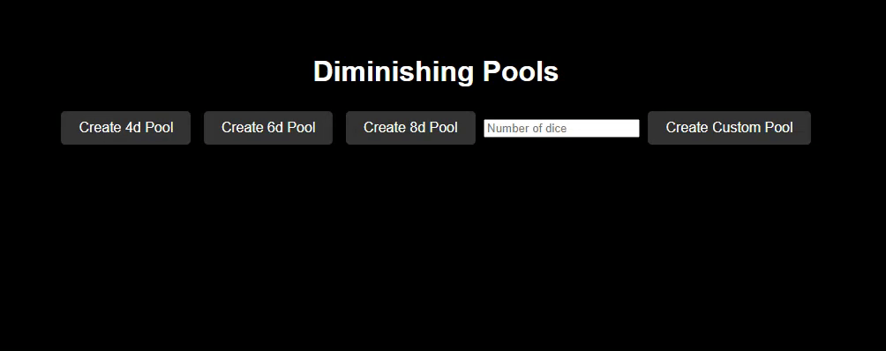

# Diminishing Pools

A web application to manage and roll diminishing dice pools for the RPG Grimwild (https://www.backerkit.com/c/projects/OddityPress/grimwild).

## Features

- Create dice pools of various sizes (4d, 6d, 8d).
- Roll the dice in the pool and see which dice are removed based on the roll results.
- Delete dice pools.
- Custom dice pool creation.
- Sounds play on pool creation, deletion, and rolling.
- Visual indicator when a pool is depleted.

## Usage

1. Click on the buttons to create dice pools of 4d, 6d, or 8d.
2. Enter a custom number of dice and click "Create Custom Pool" to create a custom pool.
3. Click the "Roll" button to roll the dice in the pool.
4. Click the "Delete" button to remove the pool.
5. Editable pool names by clicking on the pool name.

## Demo

## Setup

1. Clone the repository:
> git clone https://github.com/yourusername/diminishing-pools.git
2. Navigate to the project directory:
> cd diminishing-pools
3. Open index.html in your browser.